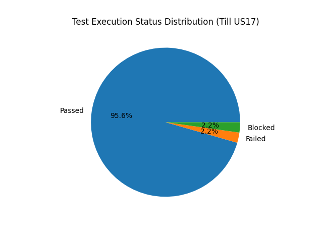

# Test Execution Report  
AJIO Web Purchase Flow – Functional Testing

**Note:** This execution report reflects test coverage completed up to User Story US17 (Product Purchase – Add to Bag). Subsequent epics are planned for future phases.

---

## 1. Execution Overview

This report summarizes the execution status of functional test cases designed for the AJIO Web Purchase Flow project.

Testing was performed on a live production environment and focused on validating the core revenue-impacting journey:

User Authentication → Product Discovery → Add to Bag → Checkout → Order Confirmation

Execution includes both positive and negative scenarios, boundary validation, session handling, and UI behavior verification.

---

## 2. Execution Summary

| Metric | Count |
|--------|-------|
| Total Unique Test Cases | 135 |
| Passed | 129 |
| Failed | 3 |
| Blocked | 3 |
| Pass % (Excluding Blocked) | 97.73% |

**Note:** Each test case is counted once in execution metrics, even if reused across shared flows.

---

## 3. Status Distribution

Overall execution indicates high functional stability across critical purchase flow modules.

- Majority of scenarios passed successfully.
- Failed cases were isolated to validation-specific edge conditions.
- Blocked cases were environment-dependent and outside tester control.

## Execution Status Distribution

---

## 4. Module-Level Observations

### High Stability Modules
- Product Search & Listing
- Filter & Sort Logic
- Add to Bag Flow
- Session Persistence

### Modules with Observed Issues
- Boundary validation cases (e.g., specific mobile number validation edge case)
- Minor UI behavior inconsistencies under specific negative conditions

No critical defects were observed that blocked the complete purchase flow from login to order placement.

---

## 5. Defect Summary

- Total Defects Raised: 3
- Severity: Functional validation defects
- No production-breaking issues identified during core purchase path execution
- All defects were documented with clear reproduction steps and linked to respective test cases

Defects were primarily related to:

- Boundary validation inconsistencies
- Input handling edge cases

---

## 6. Risk Assessment

Based on execution results:

### Low Risk Areas
- Core authentication routing
- Product browsing
- Cart accumulation logic
- Checkout navigation

### Medium Risk Areas
- Edge case input validations
- Certain boundary scenarios requiring backend confirmation

Residual risk remains limited to backend-level validations not visible at UI level.

---

## 7. Exit Criteria Validation

Testing was considered complete when:

- All high-priority test cases were executed
- All failed cases were logged with defect IDs
- RTM coverage verified no missing Acceptance Criteria
- Core purchase journey successfully validated end-to-end
- Known limitations documented

---

## 8. Conclusion

The AJIO Web Purchase Flow demonstrates strong functional stability across critical business paths.

The system successfully supports:

- Secure authentication
- Accurate product discovery
- Controlled cart management
- Structured checkout navigation
- Order confirmation flow

Minor validation issues were identified and documented. No critical blockers were observed in the primary revenue-generating workflow.

This concludes the functional test execution phase for the defined project scope.
